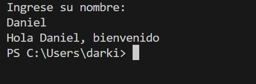
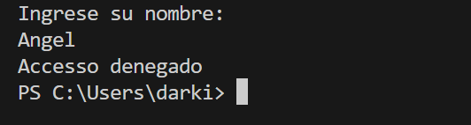

# Actividad 2
---

En esta actividad se aplican conocimientos aprendidos relacionados a Strings, Estructuras de Selección y Repetición y Arreglos en lenguaje **Java**, teniendo como base la **GuiaBasicosJava** proporcionada en plataforma. 

---

### Parte 1: Strings y Estructuras de Selección (`if / else`)

- Crea un programa Java que solicite al usuario ingresar su nombre.
- Utiliza estructuras de selección (if o switch) para verificar si el nombre ingresado coincide con uno específico que definas en tu programa; dependiendo de la coincidencia, muestra un mensaje personalizado.
-   Aprovecha las operaciones de manejo de cadenas de texto para, así, realizar comparaciones con sensibilidad a mayúsculas o minúsculas y, de esta manera, proporcionar mensajes adecuados.

#### Código usado en Java

```java
import java.util.Scanner;
public class Actividad2 {
    public static void main(String[] args) {
        String nombre1 = "Daniel";
        Scanner scanner = new Scanner(System.in);
        System.out.println("Ingrese su nombre:");
        String nombre2 = scanner.nextLine();
        if (nombre1.equals(nombre2)) {
            System.out.println("Hola Daniel, bienvenido");
        } else {
            System.out.println("Accesso denegado");
        }   
        scanner.close();
    }
}
```
> Primer captura determina que el usuario es correcto
        

---

> Segunda captura determina que el usuario es incorrecto


---

### Parte 2: Estructura de repeticiones y arreglos (`for`) 

- Desarrolla un programa que genere una lista de números enteros pares desde dos hasta 100; para lograrlo, puedes utilizar una estructura de repetición (for o while).
- Almacena estos números en un arreglo.
- Luego, utiliza una estructura de repetición para recorrer el arreglo y mostrar en pantalla los números almacenados.

#### Código usado en Java

```java
public class Actividad2 {
    public static void main(String[] args) {
        int[] arregloPares = new int[50]; // crear arreglo para pares
        int arregloIndice = 0; // indice del arreglo
        for (int numero = 2; numero <= 100; numero += 2) { // completar el arreglo con pares
            arregloPares[arregloIndice] = numero;
            arregloIndice++;
        }
        System.out.println("Números pares del 2 al 100:");// imprimir el arreglo en terminal

        for (int i = 0; i < arregloPares.length; i++) { // usar una sola linea
            System.out.print(arregloPares[i]);
            if (i < arregloPares.length - 1) { // agregar coma por estetica
                System.out.print(", ");
            }
        }
    }
}
```
