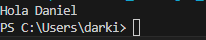
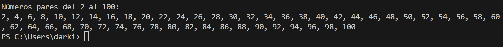
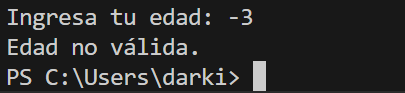
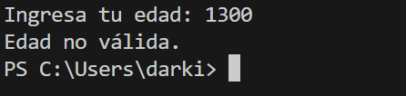
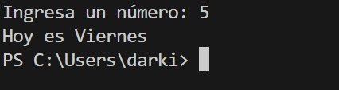
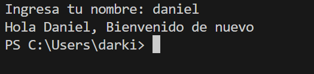
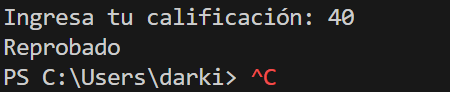

# Actividad 2

## Introducción 
Este repositorio contiene ejercicios básicos de diferentes dificultades hechos en **Java** para reforzar los conocimientos y fundamentos del lenguaje. 

---

## Ejercicios Básicos 

### Ejercicio 1: Saludo simple 

Escribe un programa que guarde tu nombre en una variable `String` y lo muestre en
pantalla con el mensaje: `Hola, <nombre>`.

#### Código usado en Java

```java
public class Main {
        public static void main(String[] args) {
            String nombre = "Daniel";
            System.out.println("Hola " + nombre);
        }
    }
```



---

### Ejercicio 2: Suma de dos enteros

Escribe un programa que pida por teclado dos números enteros y muestre la suma de
ambos

#### Código usado en Java

```java
import java.util.Scanner;
public class Main {
    public static void main(String[] args) {
        Scanner scanner = new Scanner (System.in);
        System.out.println("Ingresa un número:");
        int numero1 = scanner.nextInt();
        System.out.println("Ingresa otro número:");
        int numero2 = scanner.nextInt();
        int suma = numero1 + numero2;
        System.out.println("Resultado de la suma: " + suma);

        scanner.close();
    }
}
```


---

### Ejercicio 3: Conversión de decimal a entero 

Escribe un programa que pida un número decimal (double), lo convierta a entero
usando casting y muestre ambos valores.

#### Código usado en Java

```java
import java.util.Scanner;
public class Main {
    public static void main(String[] args) {
        Scanner scanner = new Scanner(System.in);
        System.out.print("Ingresa un número decimal: ");
        double numeroDecimal = scanner.nextDouble();
        int numeroEntero = (int) numeroDecimal;
        System.out.println("Resultado: " + numeroEntero);
        scanner.close();
    }
}
```


---

### Ejercicio 4: Calculadora básica con operadores

Escribe un programa que pida dos enteros e imprima: suma, resta, multiplicación,
división entera y el residuo (módulo) de la división.

#### Código usado en Java

```java
import java.util.Scanner;
public class Main {
    public static void main(String[] args) {
        Scanner scanner = new Scanner(System.in);
        System.out.print("Ingresa el primer número: ");
        int numero1 = scanner.nextInt();
        System.out.print("Ingresa el segundo número: ");
        int numero2 = scanner.nextInt();

        int suma = numero1 + numero2;
        int resta = numero1 - numero2;
        int multiplicacion = numero1 * numero2;
        double division = (double) numero1 / numero2;
        int modulo = numero1 % numero2;

        System.out.println("Resultado de la suma: " + suma);
        System.out.println("Resultado de la resta: " + resta);
        System.out.println("Resultado de la multiplicación: " + multiplicacion);
        System.out.println("Resultado de la división: " + division);
        System.out.println("Resultado del módulo: " + modulo);
        scanner.close();
    }
}
```


---

### Ejercicio 5: if-else (ejemplo con mayoria de edad)

Escribe un programa que pida la edad del usuario y muestre si es mayor o menor de
edad usando `if-else`

#### Código usado en Java

```java
import java.util.Scanner;
public class Main {
    public static void main(String[] args) {
        Scanner scanner = new Scanner(System.in);
        System.out.println("Ingresa tu edad para registrarte:");
        int edad = scanner.nextInt();
        if (edad >= 18) {
            System.out.println("Eres mayor de edad, te has registrado exitosamente.");
        } else {
            System.out.println("Eres menor de edad, falló al registrarte.");
        }
        scanner.close();
    }  
}
```
>Primer captura determina que la persona es mayor de edad


>Segunda captura determina que la persona es menor de edad


---

### Ejercicio 6: Clasificación por rango de edad (`if-else if`)

Escribe un programa que pida la edad y muestre un mensaje según el rango:
- Menor de 13: “Eres un niño.”
- De 13 a 17: “Eres un adolescente.”
- De 18 a 64: “Eres un adulto.”
- 65 o más: “Eres un adulto mayor.”

#### Código usado en Java

```java
import java.util.Scanner;
public class Main {
    public static void main(String[] args) {
        Scanner scanner = new Scanner(System.in);
        System.out.print("Ingresa tu edad: "); //Pedir edad al usuario
        int edad1 = scanner.nextInt();

        if (edad1 < 0) { // Determinar la categoría de edad 
            System.out.println("Edad no válida.");
        } else if (edad1 <= 3) {
            System.out.println("Eres un bebé.");
        } else if (edad1 < 13) {
            System.out.println("Eres un niño.");
        } else if (edad1 < 17) {
            System.out.println("Eres un adolescente."); 
        } else if (edad1 < 64) {
            System.out.println("Eres un adulto.");
        } else if (edad1 > 120) {
            System.out.println("Edad no válida.");// edad máxima 
        } else {
            System.out.println("Eres un adulto mayor."); 
        }  
        scanner.close();
    }  
}
```
>Primera captura determina que el usuario es un adulto


>Segunda captura muestra error si se ingresa una edad negativa


>Tercera captura muestra error si se ingresa una edad mayor a la determinada


---

### Ejercicio 7: Día de la semana (`switch`)

Escribe un programa que pida un número del 1 al 7 y muestre el día de la semana
correspondiente usando `switch`.
- 1: Lunes
- 2: Martes
- 3: Miércoles
- 4: Jueves
- 5: Viernes
- 6: Sábado
- 7: Domingo

#### Código usado en Java

```java
import java.util.Scanner;
public class Main {
    public static void main(String[] args) {
        Scanner scanner = new Scanner(System.in);
        System.out.print("Ingresa un número: "); 
        int num1 = scanner.nextInt();
        switch (num1) { // determina el día a partir del dato ingresado
            case 1:
                System.out.println("Hoy es Lunes");
                break;
            case 2:
                System.out.println("Hoy es Martes");
                break;
            case 3:
                System.out.println("Hoy es Miércoles");
                break;
            case 4:
                System.out.println("Hoy es Jueves");
                break;
            case 5:
                System.out.println("Hoy es Viernes");
                break;
            case 6:
                System.out.println("Hoy es Sábado");
                break;
            case 7:
                System.out.println("Hoy es Domingo");
                break;
            default: 
                System.out.println("Número inválido, debe ser entre 1 y 7."); // si no coincide con ningún caso
                break;
        }
        scanner.close();
    }  
}
```
>Primera captura muestra el día a partir del número ingresado


>Segunda captura muestra error al ingresar un número inválido


---

### Ejercicio 8: Comparación de nombres con `equalsIgnoreCase`

Escribe un programa que pida al usuario su nombre y lo compare con un nombre
definido en el código (por ejemplo, `"Ricardo"`).
- Si coincide (ignorando mayúsculas/minúsculas) muestra: `Hola <nombre>,
bienvenido.`
- Si no coincide, muestra: `Hola <nombre>, tu nombre no coincide.`

#### Código usado en Java

```java
import java.util.Scanner;
public class Main {
    public static void main(String[] args) {
        Scanner scanner = new Scanner(System.in);
        String nombre = "Daniel";
        System.out.print("Ingresa tu nombre: "); 
        String nombre1 = scanner.nextLine();
        if (nombre.equalsIgnoreCase(nombre1)) {
            System.out.println("Hola, " + nombre + " Bienvenido de nuevo");// determina si el nombre es igual que el determinado
        } else {
            System.out.println("Hola, " + nombre1 + "Tu nombre no coincide"); // determina si es diferente al registrado
        }
        scanner.close();
    }  
}
```
>Primera captura determina que el usuario es correcto, ignorando mayúsculas y minúsculas  


>Segunda captura determina que el usuario es diferente al definido en el código


---

### Ejercicio 9:  Clasificación de calificación (`if-else y operadores lógicos`)

Escribe un programa que pida una calificación entera de 0 a 100 y muestre:
- 90 a 100: “Excelente”
- 80 a 89: “Muy bien”
- 70 a 79: “Aprobado”
- 0 a 69: “Reprobado”
Si la calificación está fuera de ese rango, muestra: “Calificación inválida”.

#### Código usado en Java

```java
import java.util.Scanner;
public class Main {
    public static void main(String[] args) {
        Scanner scanner = new Scanner(System.in);
        System.out.print("Ingresa tu calificación: ");
        int calificacion = scanner.nextInt();
        if (calificacion <= 100 && calificacion >= 90) { // se usan "&&" para indicar "and"
            System.out.println("Excelente");
        } else if (calificacion < 89 && calificacion >= 80) {
            System.out.println("Muy Bien");
        } else if (calificacion < 79 && calificacion >= 70) {    
            System.out.println("Aprobado");
        } else if (calificacion < 69 && calificacion >= 0) {
            System.out.println("Reprobado");
        } else if (calificacion < 0 || calificacion > 100) {
            System.out.println("Calificación inválida");// si la calificación sobrepasa 100 o es negativa, se usa "||" para indicar "or"
        }
        scanner.close();
    }  
}
```

>Rango 90-100


>Rango 80-89


>Rango 70-79


>Rango 0-69


>Sí la calificación sobrepasa el límite


>Sí la calificación es negativa


> Alternativa descartando que el anterior no se cumpla y comparar con el siguiente

```java
import java.util.Scanner;
public class Main {
    public static void main(String[] args) {
        Scanner scanner = new Scanner(System.in);
        System.out.print("Ingresa tu calificación: ");
        int calificacion = scanner.nextInt();
        String resultado = ""; //variable para almacenar resultados
        if (calificacion <= 100 && calificacion >= 0)  // se usa "&&" para indicar que ambas condiciones deben cumplirse
            if (calificacion >= 90) 
                resultado = "Excelente";
             else if (calificacion >= 80) // se usan "else if" para hacer descartes y pasar a la siguiente condición
                resultado = "Muy Bien";
             else if (calificacion >=70) 
                resultado = "Aprobado";
             else // calificación menor a 70 muestra "Reprobado"
                resultado = "Reprobado";
        else    
            resultado = "Calificación inválida"; // si la calificación no es un número entre 0 y 100
            System.err.println(resultado);
            scanner.close();
        }

    }
```
---

### Ejercicio 10: Números pares en un rango (`for + arreglo pequeño`)

Escribe un programa que:
1. Pida un número entero **positivo** `n` (por ejemplo, máximo 10 para que sea
sencillo).
2. Genere los primeros `n` números pares empezando desde 2.
3. Guarde esos números en un arreglo.
4. Recorra el arreglo y muestre los números en una sola línea separados por
espacio

#### Código usado en Java

